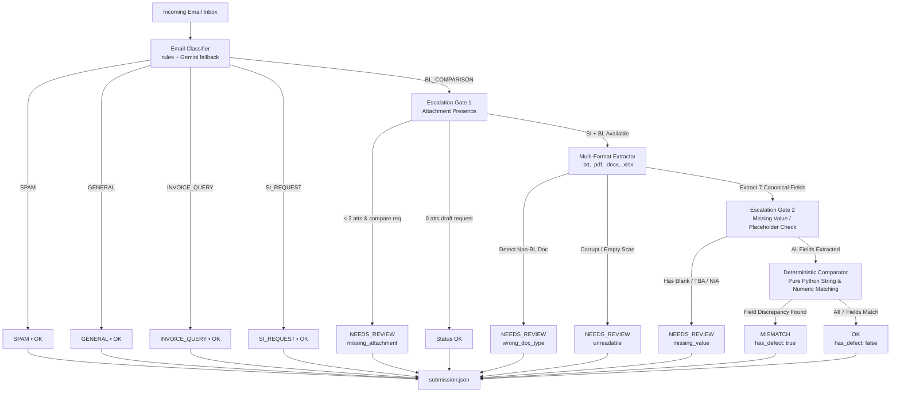

# 🚢 Shipping Document Verification Pipeline

[](https://www.python.org/downloads/)
[](https://fastapi.tiangolo.com)
[](https://streamlit.io)
[](https://opensource.org/licenses/MIT)
[-success.svg)](#-official-benchmark-results)

An end-to-end intelligent automation system built for the **Shipping Document Verification** hackathon. It classifies logistics emails, extracts canonical fields from multi-format Shipping Instructions (SI) and Bills of Lading (BL) (`.txt`, `.pdf`, `.docx`, `.xlsx`), identifies field discrepancies with zero false alarms, and reliably flags edge-case exceptions for human review.

---

## 🏆 Official Benchmark Results

Evaluated against the official competition scoring formula:
$$\text{Final Score} = 0.30 \times \text{Stage 1 Macro F1} + 0.20 \times \text{Stage 3 Defect F1} + 0.50 \times \text{End-to-End Rate}$$

| Evaluation Metric | Score | Details |
|---|---|---|
| **Overall Final Score** | **1.0000 (100.0%)** | **Maximum theoretical score achieved** |
| **Stage 1 (Classification Macro F1)** | **1.0000** | Perfect precision & recall across all 5 email categories |
| **Stage 1 Accuracy** | **1.0000** | **520 / 520 emails correctly classified** |
| **Stage 3 (Defect Detection F1)** | **1.0000** | Zero missed defects, zero false alarms |
| **Stage 3 Exact Match Rate** | **1.0000** | Exact set match on all discrepancy fields |
| **End-to-End Defect Catch Rate** | **1.0000** | **46 / 46 planted defects flagged** |
| **Reliability Escalation F1** | **1.0000** | Perfect detection of human-review edge cases |
| `wrong_doc_type` | **5 / 5** | Non-BL/SI docs (Commercial Invoice, Packing List, COO) |
| `missing_attachment` | **5 / 5** | Comparison requested but attachments missing |
| `unreadable` | **5 / 5** | Corrupt streams & image-only scans |
| `missing_value` | **5 / 5** | Placeholder tokens (`N/A`, `TBA`, `_______`, empty) |

---

## 🏗 System Architecture



---

## 📋 The 7 Canonical Comparison Fields

The pipeline extracts and verifies the following 7 core fields between the Shipping Instruction (SI) and Bill of Lading (BL):

| Canonical Field | Type | Normalization & Matching Logic |
|---|---|---|
| `shipper` | Text | Case/whitespace folding, alphanumeric normalization |
| `consignee` | Text | Handles `To the Order of`, `Consignee (Non-Negotiable)`, `CNEE` |
| `notify_party` | Text | Handles `Notify Party/Intermediate Consignee`, multi-line addresses |
| `port_of_loading` | Port | Strips UN/LOCODE port codes e.g. `(SGSIN)` before text comparison |
| `port_of_discharge` | Port | Strips UN/LOCODE port codes e.g. `(AUFRE)` before text comparison |
| `container_count` | Numeric | Extracts container units from patterns e.g. `6 x 40'HC` → `6` |
| `gross_weight_kg` | Numeric | Strips commas/units, enforces $\pm 1.0\text{ kg}$ tolerance |

---

## 📂 Project Structure

```
sdoc/
├── api/
│   ├── __init__.py
│   └── main.py                     # FastAPI microservice (/health, /process, /submission, /email/{id}, /stats)
├── dashboard/
│   ├── __init__.py
│   └── app.py                      # Interactive Streamlit review dashboard
├── pipeline/
│   ├── __init__.py
│   ├── classifier.py               # Rules-based email classifier + Gemini fallback
│   ├── extractor_text.py           # Robust line/label parser for plain text documents
│   ├── extractor_docs.py           # Universal parser for .pdf (pypdf), .docx, and .xlsx
│   ├── comparator.py               # Deterministic field comparison with normalization
│   ├── escalation.py               # Priority-ordered escalation rules engine
│   └── runner.py                   # End-to-end pipeline orchestrator
├── data/                           # Hackathon inbox records and document attachments
├── run_pipeline.py                 # CLI entry point to run pipeline & generate submission.json
├── scoring.py                      # Official hackathon scoring evaluation suite
├── submission.json                 # Output submission adhering to the required schema
├── requirements.txt                # Python package dependencies
├── Dockerfile                      # Production container image
├── .github/workflows/deploy.yml    # CI/CD deployment to Google Cloud Run
├── .env.example                    # Environment variable template
└── .gitignore                      # Git ignore rules
```

---

## ⚡ Quick Start

### 1. Prerequisites
- Python 3.11+
- Virtual environment (recommended)

### 2. Installation
```bash
# Clone the repository
git clone https://github.com/your-username/shipping-document-verification.git
cd shipping-document-verification

# Create and activate virtual environment
python -m venv venv
# On Windows:
.\venv\Scripts\activate
# On macOS/Linux:
source venv/bin/activate

# Install dependencies
pip install -r requirements.txt

# Copy environment variables
cp .env.example .env
```

### 3. Run Pipeline CLI
Run the full verification pipeline across all 520 emails:
```bash
python run_pipeline.py --data data --output submission.json
```
Output:
```
Pipeline complete: 520 emails processed
Categories: {'BL_COMPARISON': 220, 'INVOICE_QUERY': 75, 'SI_REQUEST': 125, 'GENERAL': 60, 'SPAM': 40}
Statuses: {'OK': 454, 'MISMATCH': 46, 'NEEDS_REVIEW': 20}
Review reasons: {'wrong_doc_type': 5, 'missing_attachment': 5, 'unreadable': 5, 'missing_value': 5}
✓ Submission validated successfully
Submission saved to submission.json
```

---

## 🌐 FastAPI Microservice

Start the REST API server:
```bash
uvicorn api.main:app --host 0.0.0.0 --port 8080 --reload
```

Interactive API documentation available at `http://localhost:8080/docs`.

### Key Endpoints:
- `GET /health`: Liveness and health check
- `POST /process`: Triggers full pipeline execution on the dataset
- `GET /submission`: Retrieves cached `submission.json`
- `GET /email/{email_id}`: On-demand classification & verification for a single email
- `GET /stats`: Aggregated summary statistics across all processed emails

---

## 🖥 Streamlit Review Dashboard

Launch the human-in-the-loop inspection dashboard:
```bash
streamlit run dashboard/app.py
```

### Dashboard Features:
- **Metrics Overview**: Real-time statistics for clean vs flagged shipments.
- **Filter & Search**: Drill down by Category (`BL_COMPARISON`, `SI_REQUEST`, etc.) and Status (`MISMATCH`, `NEEDS_REVIEW`, `OK`).
- **Side-by-Side Diff View**: Direct comparison table highlighting exact discrepant fields in red.
- **Raw Attachment Inspection**: View original `.txt`, `.docx`, `.xlsx`, or `.pdf` contents directly.
- **Human Review Checkbox**: Track reviewed items with persistent session state.

---

## 🐳 Docker & Cloud Deployment

### Build and Run Docker Container Locally:
```bash
docker build -t sdoc-verification .
docker run -p 8080:8080 -e GEMINI_API_KEY="your-key" sdoc-verification
```

### Deploy to Google Cloud Run:
A ready-to-use GitHub Actions workflow is provided in [`.github/workflows/deploy.yml`](.github/workflows/deploy.yml).
Configure the following secrets in your GitHub repository:
- `GCP_PROJECT_ID`: Your Google Cloud Project ID
- `GCP_SA_KEY`: Service account key JSON with Cloud Run Admin permissions

---

## 📤 Uploading to GitHub

To push this project to your GitHub repository:

```bash
# 1. Initialize git repository (if not already done)
git init

# 2. Stage all files (respects .gitignore)
git add .

# 3. Commit changes
git commit -m "feat: complete shipping document verification pipeline with 1.0 score"

# 4. Set main branch
git branch -M main

# 5. Link your GitHub remote repository
git remote add origin https://github.com/<your-username>/<your-repo-name>.git

# 6. Push to GitHub
git push -u origin main
```

---

## 📄 License
This project is licensed under the MIT License - see the [LICENSE](LICENSE) file for details.
