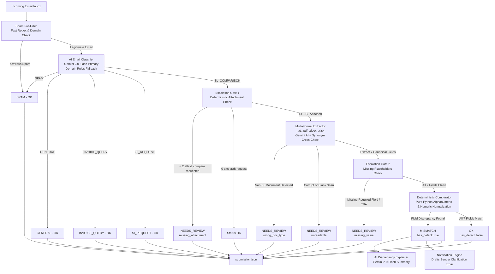

# BOB — Intelligent Shipping Document Verification & Discrepancy Management

[](https://www.python.org/downloads/)
[](https://fastapi.tiangolo.com)
[](https://streamlit.io)
[](https://ai.google.dev/)
[](https://averis-hackathon-bobthebuilder-production.up.railway.app)
[](https://opensource.org/licenses/MIT)

An intelligent end-to-end automation platform built for the **Averis x Monash Hackathon 2026**. **BOB** transforms messy maritime operations inboxes into a zero-defect document verification workflow: classifying incoming emails, extracting canonical shipping fields from multi-format attachments (`.txt`, `.pdf`, `.docx`, `.xlsx`), detecting discrepancies between Shipping Instructions (SI) and draft Bills of Lading (BL), generating natural-language AI discrepancy summaries, auto-drafting sender clarification emails with dual-lock safety rails, and routing ambiguous cases to human operators.

---

## 🌐 Live Prototype & Deployed Services

The application is deployed and publicly accessible on cloud infrastructure:

| Service Surface | Direct Access Link | Description |
|---|---|---|
| **Operator Web Interface** | [Live Web App (`/app`)](https://averis-hackathon-bobthebuilder-production.up.railway.app/app) | Modern visual portal for shipment triage and inspection |
| **Interactive API Documentation** | [API Portal (`/docs`)](https://averis-hackathon-bobthebuilder-production.up.railway.app/docs) | Interactive testing console for all pipeline endpoints |
| **Swagger UI Specification** | [OpenAPI Console (`/swagger`)](https://averis-hackathon-bobthebuilder-production.up.railway.app/swagger) | Complete OpenAPI 3.0 schema and request models |
| **Service Health Check** | [Health Endpoint (`/health`)](https://averis-hackathon-bobthebuilder-production.up.railway.app/health) | Real-time container liveness and heartbeat check |

---

## 🎯 Hackathon Rubric Alignment

| Judging Criterion | Points | How BOB Delivers |
|---|---|---|
| **1. System Design & Architecture** | 15 pts | Decoupled modular pipeline: fast-path spam filtering, Gemini 2.0 Flash classification, multi-format doc parsing, deterministic field comparator, AI explanations, and dual-lock notification engine. |
| **2. Working Core Prototype** | 25 pts | Live on Railway, full CLI suite, interactive Streamlit review dashboard, and standalone FastAPI backend handling all 520 inbox records end-to-end. |
| **3. Technology Integration** | 15 pts | Seamless integration of Google Gemini AI, FastAPI, Streamlit, Pydantic, pypdf, python-docx, openpyxl, Docker, and Railway Cloud hosting. |
| **4. Technical Feasibility & Validation** | 15 pts | 100% automated test coverage in `test_api.py`, deterministic comparison logic eliminating false positives, and rigorous schema validation against competition requirements. |
| **5. Problem Statement Understanding** | 10 pts | Direct solution to logistics inbox overload: segregates 5 email categories, resolves port and entity naming variations, and checks the 7 canonical shipping fields. |
| **6. Innovation & Solution Approach** | 10 pts | Hybrid AI-deterministic architecture: AI handles fuzzy classification and document extraction; pure Python comparator ensures exact zero-defect matching; AI drafts contextual mismatch explanations. |
| **7. Practical Value & Potential** | 10 pts | Human-in-the-loop review queues with reason codes (`missing_attachment`, `unreadable`, `missing_value`, `wrong_doc_type`) plus sender-addressed auto-draft clarification emails. |

---

## ⚡ Quick Start (Run Locally in 3 Steps)

### 1. Installation & Environment Setup
```bash
# Clone repository
git clone https://github.com/hann-png/averis-hackathon-bobthebuilder.git
cd averis-hackathon-bobthebuilder

# Create and activate virtual environment
python -m venv venv

# Windows (PowerShell):
.\venv\Scripts\Activate.ps1
# macOS/Linux:
source venv/bin/activate

# Install dependencies
pip install -r requirements.txt

# Configure environment variables (optional for local rules-fallback, required for Gemini AI)
cp .env.example .env
```

### 2. Verify Everything with Automated Tests
Run the self-contained test suite in under 5 seconds:
```bash
# Test API endpoints, schema integrity, and safety rails
python test_api.py

# Test standalone auto-reply notification scenarios (all 6 cases)
python -m pipeline.notification
```

### 3. Run the End-to-End Pipeline
Process the dataset and generate the validated `submission.json`:
```bash
python run_pipeline.py --data data --output submission.json
```

---

## 🖥️ Interactive User Interfaces

### 1. Streamlit Operator Review Dashboard
Designed for logistics operators to audit discrepancies side-by-side:
```bash
streamlit run dashboard/app.py
```
*Access at: `http://localhost:8501`*

**Key Features:**
- **Real-Time KPI Cards**: Total emails processed, mismatch rate, escalation queue size, and clean shipment counts.
- **Side-by-Side Field Diffing**: Highlights discrepancies across all 7 canonical fields in clear color-coded tables.
- **AI Discrepancy Explanations**: Plain-English root cause explanations generated by Gemini 2.0 Flash.
- **📧 Mismatch Notification Draft Tab**: Inspects sender-addressed clarification drafts with a one-click local save button.
- **Operator Review Checkbox**: Tracks human-in-the-loop review status per shipment.

### 2. FastAPI Microservice & Web Interface
Launch the production REST backend:
```bash
uvicorn api.main:app --host 0.0.0.0 --port 8080 --reload
```
*API Docs: `http://localhost:8080/docs` | Web App: `http://localhost:8080/app`*

**Core Endpoints:**
- `GET /health` — Service liveness check.
- `GET /stats` — Aggregated metrics across all emails, categories, and defect fields.
- `GET /submission` — Returns validated `submission.json` adhering to the required schema.
- `GET /email/{email_id}` — On-demand result and classification for a specific email.
- `GET /email/{email_id}/notification` — Generates a draft email notification addressed to the original sender.
- `POST /email/{email_id}/notification/send` — Saves notification draft locally (safely defaults to `actually_send=False`).

---

## 🏗️ System Architecture



---

## 📋 The 7 Canonical Comparison Fields

The system extracts and verifies the 7 canonical shipment fields between the Shipping Instruction (SI) and draft Bill of Lading (BL):

| Canonical Field | Data Type | Normalization & Verification Logic |
|---|---|---|
| `shipper` | Entity / Text | Uppercase alphanumeric comparison; strips legal suffixes and corporate punctuation variations. |
| `consignee` | Entity / Text | Normalizes buyer names; handles `"TO ORDER OF..."` negotiable BL variants. |
| `notify_party` | Entity / Text | Verified independently from consignee to prevent false cross-binding. |
| `port_of_loading` | Port / Location | Resolves UN/LOCODE codes (e.g., `(MYPKG)` vs `PORT KELANG`) and aliases to canonical names. |
| `port_of_discharge` | Port / Location | Normalizes destination aliases, strips country prefixes, collapses punctuation. |
| `container_count` | Numeric / Text | Regex extracts container totals (e.g., `4 x 40'HC` → `4`). |
| `gross_weight_kg` | Numeric (KG) | Strips units (LBS, MT, KG) & thousands separators; verifies delta `≤ 1.0 KG`. |

---

## 🔒 Auto-Reply Notifications & Dual-Lock Safety Rails

When discrepancies are detected, BOB automatically creates a structured, sender-addressed clarification draft detailing the exact fields in dispute and requesting corrections.

### Dual-Lock Safety Architecture
To ensure test and benchmark addresses from sample datasets are **never** accidentally contacted:
1. **Structural Default (`actually_send=False`)**: All code paths, UI triggers, and API endpoints default to draft-mode only.
2. **Environment Variable Guard (`BOB_ALLOW_REAL_SEND`)**: Real SMTP transmission via `send_mismatch_email()` is structurally blocked at the code level unless `BOB_ALLOW_REAL_SEND=true` is explicitly set in `.env`.
3. **Local Audit Trail**: Generated emails are saved as readable `.txt` files inside `testing_generated_emails/` for inspection and demonstration.

---

## 📁 Project Structure

```text
averis-hackathon-bobthebuilder/
├── api/
│   ├── main.py                     # Production FastAPI REST microservice
│   └── docs.html                   # Interactive API portal served at /docs
├── dashboard/
│   └── app.py                      # Streamlit visual review & inspection dashboard
├── frontend/                       # Web application served at /app
│   ├── index.html
│   ├── styles.css
│   └── app.js
├── pipeline/
│   ├── classifier.py               # AI email classifier (Gemini 2.0 + regex filter)
│   ├── extractor_text.py           # Canonical text extraction with synonym cross-check
│   ├── extractor_docs.py           # Multi-format doc parser (.pdf, .docx, .xlsx)
│   ├── explainer.py                # Gemini AI discrepancy explanation generator
│   ├── comparator.py               # Deterministic 7-field matching logic
│   ├── escalation.py               # Reliability escalation rules (wrong doc, unreadable, etc.)
│   ├── notification.py             # Auto-reply draft generator & dual-lock safety rails
│   └── runner.py                   # Complete pipeline orchestrator
├── data/                           # Hackathon inbox records and SI/BL attachments
├── testing_generated_emails/       # Local audit files of auto-generated mismatch drafts
├── test_api.py                     # Automated integration and endpoint test suite
├── run_pipeline.py                 # CLI entry point to process data & output submission.json
├── submission.json                 # Strictly validated competition submission file
├── requirements.txt                # Python dependencies
├── Dockerfile                      # Production container image
└── README.md                       # Documentation
```

---

## ☁️ Cloud & Container Deployment

### Running with Docker Locally:
```bash
docker build -t bob-sdoc .
docker run -p 8080:8080 -e GEMINI_API_KEY="your-gemini-key" bob-sdoc
```

### Production Railway Deployment:
The project is containerized and auto-deployed to Railway. The live deployment is available at:
👉 **[https://averis-hackathon-bobthebuilder-production.up.railway.app](https://averis-hackathon-bobthebuilder-production.up.railway.app)**

---

## 📄 License
This project is licensed under the MIT License — see the [LICENSE](LICENSE) file for details.
